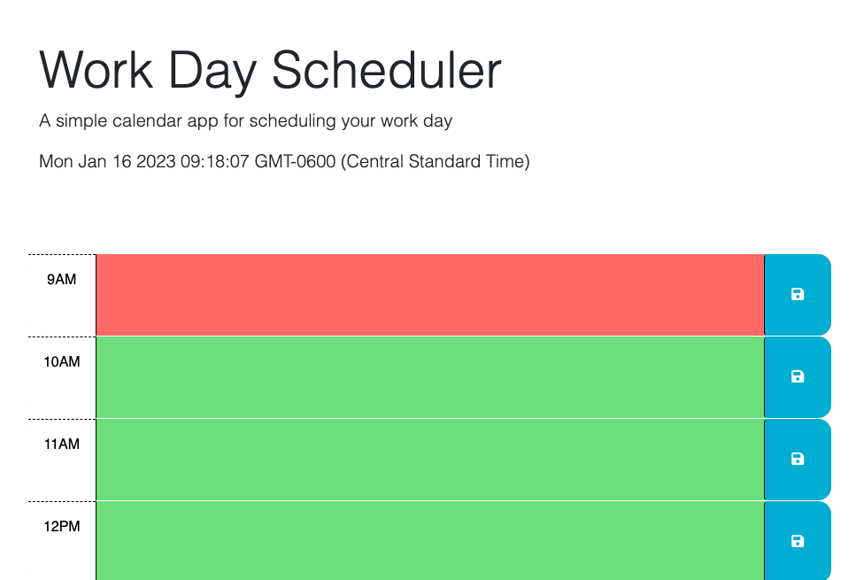

# work-day-scheduler

## Description

The purpose of this project was to use jqery and the Day.js API to create a work day scheduler that displays the hours of the work day, color codes them as being past, present, or future, and saves entered events and displays them upon refreshing the page.

[Link to application](https://jboyce313.github.io/work-day-scheduler/)
